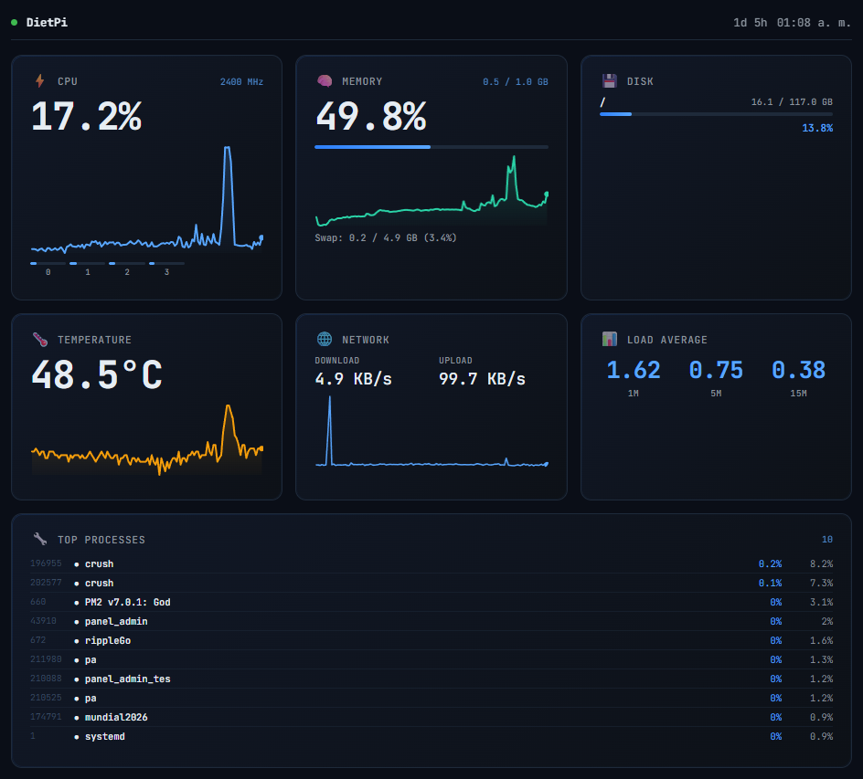

<div align="center">

# Panel Admin

**Un panel de control web en tiempo real para tu Raspberry Pi — hecho en Go, ligero, sin dependencias externas.**

[](https://go.dev/)
[](https://www.raspberrypi.com/)
[](LICENSE)
[](https://github.com/xErik444x/dietpi-server-info/releases)



</div>

---

## Que es?

**Panel Admin** es un dashboard web que muestra en vivo el estado de tu sistema: CPU, memoria, disco, temperatura, red y los procesos mas exigentes. Todo desde el propio `/proc` y `/sys` — **cero agentes, cero servicios externos, cero base de datos**.

Descarga el binario de la [ultima release](https://github.com/xErik444x/dietpi-server-info/releases) para tu Raspberry Pi, descomprimelo y arrancalo con PM2:

```bash
# 1. Descargar y descomprimir (Pi 4 / Pi 5)
wget https://github.com/xErik444x/dietpi-server-info/releases/latest/download/panel_admin-linux-arm64.tar.gz
tar -xzf panel_admin-linux-arm64.tar.gz
chmod +x panel_admin

# 2. Instalar PM2 (si no lo tienes)
npm install -g pm2

# 3. Arrancar con el ecosystem incluido en el tarball
pm2 start ecosystem.config.js
pm2 save
pm2 startup   # opcional: auto-arranque al iniciar el sistema

# Alternativa: arrancar ad-hoc sin ecosystem (puerto custom via flag)
pm2 start ./panel_admin --name panel-admin -- --port 9090
pm2 save
```

```
+--------------------------------------------------+
|  • panel_admin         uptime 4d 12h    21:48:03 |
+--------------------------------------------------+
|  [ CPU 38% ]   [ MEM 2.1/8 GB ]   [ 52.3 C ]   |
|  [ DISK 24% ]  [ LOAD 0.42 ]       [ NET ... ]  |
|                                                   |
|  Top procesos                                     |
|  PID    NAME        CPU%   MEM%   RSS            |
|  1023   nginx       12.4   3.1    124 MB         |
|  881    node        8.2    5.6    220 MB         |
+--------------------------------------------------+
```

## Caracteristicas

- **Monitoreo en tiempo real** mediante Server-Sent Events (SSE).
- **Multi-nucleo**: grafico por core, frecuencia actual de la CPU.
- **Temperatura** del SoC (Raspberry Pi y otros Linux).
- **Disco, memoria, swap, red** y **load average** en una sola vista.
- **Top 10 procesos** ordenados por consumo de CPU.
- **UI responsive**, con tema oscuro, graficos en `<canvas>` y Service Worker para uso offline.
- **Binario estatico** sin dependencias de runtime. Un solo archivo, ~8 MB.
- **Instalacion minima**: descargar, ejecutar, listo.

## Stack

| Capa       | Tecnologia                                                |
| ---------- | --------------------------------------------------------- |
| Backend    | Go (stdlib) — `net/http`, `encoding/json`, `/proc`, `/sys` |
| Streaming  | Server-Sent Events                                        |
| Frontend   | HTML + CSS + JS vanilla, sin frameworks                    |
| Procesos   | PM2 (opcional, recomendado)                                |

## Inicio rapido

### En tu Raspberry Pi

```bash
# Descarga la ultima release (ejemplo para Pi 4 / Pi 5 - arm64)
wget https://github.com/xErik444x/dietpi-server-info/releases/latest/download/panel_admin-linux-arm64.tar.gz
tar -xzf panel_admin-linux-arm64.tar.gz
chmod +x panel_admin
./panel_admin                  # usa el puerto por defecto (8080)
# o bien: ./panel_admin --port 4041
```

Abre `http://<ip-de-tu-pi>:8080` en el navegador.

### Build local (cualquier plataforma)

```bash
git clone https://github.com/xErik444x/dietpi-server-info.git
cd panel_admin
go build -ldflags="-s -w" -o panel_admin .
./panel_admin --port 8080
```

## Configuracion

El puerto se resuelve con este orden de prioridad (de mayor a menor):

1. Flag CLI `--port`
2. Variable de entorno `PORT`
3. Default `8080`

| Origen           | Ejemplo                                  | Notas                         |
| ---------------- | ---------------------------------------- | ----------------------------- |
| Flag CLI         | `./panel_admin --port 4041`              | Tiene prioridad maxima        |
| Variable de entorno | `PORT=4041 ./panel_admin`             | Respetada si no hay flag      |
| Default          | `./panel_admin`                          | `8080`                        |

```bash
# Ejemplos
./panel_admin                  # :8080
./panel_admin --port 4041      # :4041
PORT=9000 ./panel_admin        # :9000
./panel_admin --port 9001      # :9001 (flag gana sobre PORT)
```

Argumentos disponibles:

| Flag       | Default | Descripcion                                                                  |
| ---------- | ------- | ---------------------------------------------------------------------------- |
| `--port`   | `8080`  | Puerto HTTP. Tambien acepta la variable de entorno `PORT` como alternativa.  |
| `--help`   | —       | Muestra la ayuda con todos los flags disponibles.                            |

## Despliegue con PM2

### Produccion (release)


Para Pi 2 v1.2 / Pi 3 / Pi 3+ usa el archivo `panel_admin-linux-armv7.tar.gz`. Ajusta la ruta `cwd` en `ecosystem.config.js` si lo descomprimes en otro directorio (por defecto `/root/programacion/panel_admin`).

```bash
# Comandos utiles
pm2 status                # ver estado
pm2 logs panel-admin      # logs en vivo
pm2 restart panel-admin   # reiniciar
pm2 stop panel-admin      # detener
pm2 delete panel-admin    # eliminar
```

Logs persistentes en `./logs/out.log` y `./logs/err.log`. Auto-reinicio si supera `128M` de RAM.

### Modo desarrollo (con autoreload)

Para iterar en local con `go run` y autoreload al guardar archivos:

```bash
# Opcion 1: pm2-dev (reinicia al cambiar archivos)
pm2-dev start --name panel-admin-dev -- go run .

# Opcion 2: ecosystem en modo watch
pm2 start ecosystem.config.js --watch
pm2 logs panel-admin
```

> `pm2-dev` requiere `npm i -g pm2-dev`. La opcion `--watch` reinicia el proceso ante cualquier cambio en `*.go`, `static/`, etc.

## Endpoints

| Ruta          | Tipo     | Descripcion                                       |
| ------------- | -------- | ------------------------------------------------- |
| `/`           | HTML     | Dashboard                                         |
| `/api/events` | SSE      | Stream JSON con metricas cada 2 segundos          |
| `/static/*`   | assets   | Iconos, manifest, service worker                  |


## Capturas

<div align="center">
  
</div>
